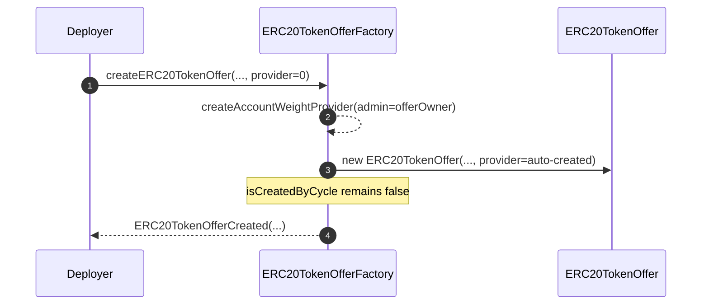
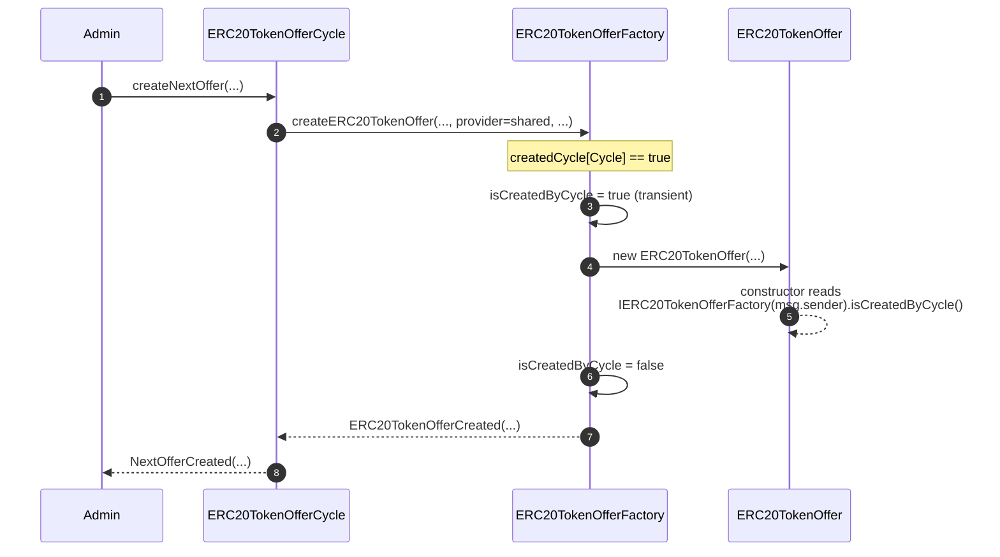
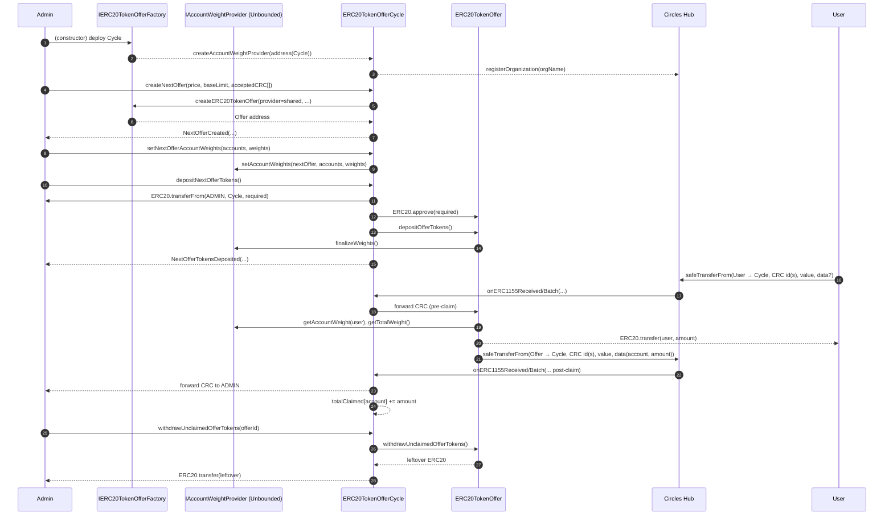
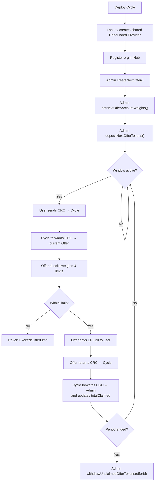
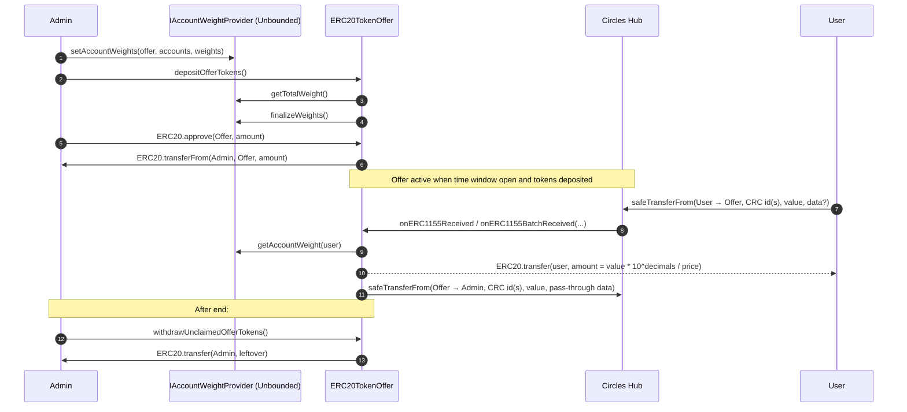
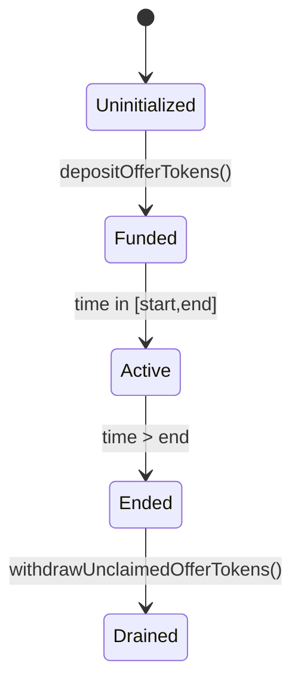

# ERC20 Token Offer Factory

The `ERC20TokenOfferFactory` is the entry point for creating:

- **Account Weight Providers** (unbounded only)  
- **Standalone ERC20TokenOffer** contracts  
- **ERC20TokenOfferCycle** contracts (time-based series of offers)

It also manages bookkeeping so offers and cycles can safely trust each other.

---

## Key Features

- **Provider creation**
- `createAccountWeightProvider(admin)` → deploys a new unbounded provider.  
- Emits `AccountWeightProviderCreated`.  
- Marks the provider in `createdAccountWeightProvider`.

- **Offer creation**
- `createERC20TokenOffer(...)` → deploys a new `ERC20TokenOffer`.  
- If `accountWeightProvider == address(0)`, the factory **auto-creates an unbounded provider** with `offerOwner` as admin.  
- Otherwise, the given provider must have been created by this factory.  
- Emits `ERC20TokenOfferCreated`.

- **Cycle creation**
- `createERC20TokenOfferCycle(...)` → deploys a new `ERC20TokenOfferCycle`.  
- The cycle itself creates its shared provider internally during construction.  
- Emits `ERC20TokenOfferCycleCreated`.  
- Marks the cycle in `createdCycle`.

- **Transient flag**
- `isCreatedByCycle` is a `transient` boolean that flips to `true` only during the constructor call of an `ERC20TokenOffer` if it was spawned by a cycle.  
- Offers can check this flag to know whether they were created directly by a cycle or standalone.  
- The flag resets immediately after deployment.

---

## Events

- `AccountWeightProviderCreated(provider, admin)`  
- `ERC20TokenOfferCreated(tokenOffer, offerOwner, provider, offerToken, price, limit, duration, orgName, acceptedCRC)`  
- `ERC20TokenOfferCycleCreated(offerCycle, cycleOwner, offerToken, offersStart, duration, offerName, cycleName)`

---

## Example Flows

### Standalone Offer
1. Call `createERC20TokenOffer(...)` with `accountWeightProvider = address(0)` → factory auto-creates an unbounded provider.  
2. The offer is deployed and linked to that provider.  
3. Admin can then set weights and deposit tokens in the offer.

### Offer Cycle
1. Call `createERC20TokenOfferCycle(...)`.  
2. The cycle deploys with its own shared provider.  
3. The cycle later calls `createNextOffer(...)` internally, which routes back to the factory.  
4. Factory flips `isCreatedByCycle = true` so the new offer knows it belongs to a cycle.  

---

## Integration Notes

- All providers and cycles are tracked on-chain via `createdAccountWeightProvider` and `createdCycle`.  
- Default provider type is **unbounded** if none is given.  
- `isCreatedByCycle` is **transient**: only visible during an offer’s constructor.  
- Off-chain indexers should listen to the events for reliable logs of new deployments.




---

# ERC20 Token Offer Cycle

`ERC20TokenOfferCycle` orchestrates a series of fixed-window ERC-20 offers that sell a token for CRC via the **Circles v2 Hub**.  
All offers in the cycle share a single [`IAccountWeightProvider`](./src/interfaces/IAccountWeightProvider.sol), so eligibility and limits are centrally managed.

---

## What it does

- **Time-based rotation:** Each offer occupies a slot of `OFFER_DURATION` seconds.  
`currentOfferId()` derives the active offer from `block.timestamp`.
- **Factory-driven:** The cycle uses an `IERC20TokenOfferFactory` to:
- Create the **shared unbounded weight provider**.
- Create per-period `ERC20TokenOffer` instances.
- **Hub integration:** The cycle registers an org in the **Circles Hub** and proxies CRC:
- **Pre-claim:** CRC sent to the cycle is forwarded to the current offer.
- **Post-claim:** CRC coming back from the offer is forwarded onward to the admin.
- **Soft lock (optional):** If enabled, a user can’t send CRC to the current offer if their **claimed ERC-20** exceeds their **current wallet balance** (prevents “sell-then-double-spend” patterns).

---

## Lifecycle

1. **Initialize cycle**
 - Constructor creates the **shared unbounded weight provider**, sets `OFFERS_START`, `OFFER_DURATION`, registers a Hub org, emits `CycleConfiguration`.

2. **Create next offer**
 - Admin calls `createNextOffer(price, baseLimit, acceptedCRC[])`.
 - Deploys the next `ERC20TokenOffer` (id = current + 1).
 - Records `acceptedCRC` for that offer (Hub trust list).

3. **Fund next offer**
 - Admin calls `depositNextOfferTokens()` (after approving the cycle).
 - Cycle pulls ERC-20 from admin, safe-approves the new offer, calls `offer.depositOfferTokens()` (which finalizes weights).

4. **Active period (claims)**
 - Users send CRC via Hub to the cycle.
 - Cycle forwards CRC to the **current** offer (pre-claim path).
 - Offer pays ERC-20 to user and calls back with CRC to the cycle (post-claim path).
 - Cycle forwards CRC to the **admin** and emits `OfferClaimed`.

5. **Withdraw leftovers (past offers)**
 - Admin calls `withdrawUnclaimedOfferTokens(offerId)` to recover unsold ERC-20.




---

## Gotchas & tips

- **Funding guard:** `createNextOffer` reverts if the next offer exists **and** is already funded.  
- **Approve before deposit:** Admin must `approve(cycle, requiredAmount)` before `depositNextOfferTokens()`.  
- **Shared provider scope:** When setting weights for the **next** offer, the cycle uses the next offer’s **address** as the scope key in the shared provider.  
- **Trust syncing:** `syncOfferTrust()` updates Hub trust end-times to the current offer’s natural end.  
- **Readiness check:** `isOfferAvailable()` is true only when the **time window** is active **and** the offer is **funded**.

---

# ERC20 Token Offer

The `ERC20TokenOffer` contract implements a fixed-window token sale in exchange for CRC (Circles).  
It integrates with a pluggable [`IAccountWeightProvider`](./src/interfaces/IAccountWeightProvider.sol) to gate **per-account limits** and uses the **Circles v2 Hub** for CRC transfers.

---

## Lifecycle

1. **Deployment**  
   - Parameters set: ERC-20 token, price in CRC, base per-account limit, start time, duration.  
   - Registers an organization in the Hub and trusts the provided CRC ids.

2. **Weight assignment**  
   - Admin sets weights via the unbounded provider.

3. **Deposit**  
   - Admin calls `depositOfferTokens()`.  
   - Pulls in the exact ERC-20 amount required to back all potential claims.  
   - Freezes the weight provider (`finalizeWeights()`).  
   - Offer is now ready.

4. **Claim**  
   - During the active window, eligible accounts spend CRC (via Hub callbacks).  
   - Contract sends them ERC-20 tokens at the fixed price.  
   - Each account is limited to `baseLimit * weight / weightScale`.  
   - First-time claim increments `claimantCount`.

5. **Withdraw leftover**  
   - After the end, admin may call `withdrawUnclaimedOfferTokens()` to recover any unsold ERC-20 balance.

---

## Eligibility & Limits

- **Eligibility** is defined entirely by the configured `ACCOUNT_WEIGHT_PROVIDER`.  
- **Per-account limit**:  limit(account) = BASE_OFFER_LIMIT_IN_CRC * weight(account) / WEIGHT_SCALE
- **Total ERC-20 required**:  amount = (BASE_OFFER_LIMIT_IN_CRC * totalWeight * 10^TOKEN_DECIMALS)
/ (WEIGHT_SCALE * TOKEN_PRICE_IN_CRC)


This ensures the contract can satisfy all claims if everyone spends to their limit.

---

## Key Functions

- `isOfferAvailable()` → true if in window and tokens deposited.  
- `isAccountEligible(account)` → weight > 0.  
- `getAccountOfferLimit(account)` → weighted CRC spend cap.  
- `getAvailableAccountOfferLimit(account)` → remaining CRC cap after usage.  
- `depositOfferTokens()` → pulls required ERC-20 and finalizes weights.  
- `withdrawUnclaimedOfferTokens()` → recovers leftover tokens after end.  

---

## Integration Notes

- **Hub callbacks** (`onERC1155Received`, `onERC1155BatchReceived`) handle CRC payments automatically.  
- If `CREATED_BY_CYCLE == true`, claims can only be initiated by the Cycle owner, with beneficiary encoded in `data`.  
- The contract enforces **idempotent accounting**: multiple calls with same weights or limits are safe.  
- **Finalization**: after deposit, weights are frozen and cannot be changed.

---

## Example Use Cases

- Distribution of a new ERC-20 token to an allowlisted community.  
- Weighted airdrops with per-account caps.  
- Cycle-created offers where eligibility is managed off-chain but enforced via Hub trust.

---



```mermaid
flowchart TD
    A[Deploy Offer] --> B[Register org & trust accepted CRC]
    B --> C["Admin sets weights in Provider (Unbounded)"]
    C --> D["Admin calls depositOfferTokens()"]
    D --> E["Offer pulls required ERC20\nand Provider.finalizeWeights()"]
    E --> F{Active? (time window && tokens deposited)}
    F -- "No" --> F
    F -- "Yes" --> G["User sends CRC via Hub"]
    G --> H["Offer checks weight/limit"]
    H --> I{Within limit?}
    I -- "No" --> I2["Revert ExceedsOfferLimit"]
    I -- "Yes" --> J["Offer pays ERC20 to user"]
    J --> K["Offer forwards CRC to Admin via Hub"]
    K --> L{After end?}
    L -- "No" --> F
    L -- "Yes" --> M["Admin withdraws leftover ERC20"]
```


---

# Account Weight Providers

This package contains the unbounded implementation of [`IAccountWeightProvider`](./src/interfaces/IAccountWeightProvider.sol).  
It defines how accounts are deemed *eligible* and how their *weights* are tracked.

---

## Implementation

### AccountWeightProviderUnbounded
- **Graded weights**: any non-negative integer.
- Weights are measured in **basis points** (`getWeightScale() = 10_000`).
- Total weight = sum of all per-account weights (no maximum cap).
- Useful when eligibility is proportional (e.g. multipliers, boosts, variable scoring).

---

## Admin Workflow

1. **Assign weights**  
 `setAccountWeights(offer, accounts, weights)`  
 - Directly updates stored weights.  
 - Zero weight removes eligibility.

2. **Finalize weights**  
 `finalizeWeights()`  
 - Locks state permanently for that offer.  
 - Emits `WeightsFinalized(offer, accountsCount, totalWeight)`.

---

## Querying

All queries are **scoped to the calling offer** (`msg.sender`).

- `getAccountWeight(account)` → the account’s weight for the calling offer.  
- `getTotalWeight()` → sum of all weights for the calling offer.  
- `getTotalAccounts()` → count of accounts with nonzero weight.  
- `getWeightScale()` → the scale constant (`10_000` = basis points).

---

## Integration Notes

- **Immutable admin**: set once in constructor, cannot be changed.  
- **Idempotent updates**: setting the same weight twice has no effect.  
- **Finalization**: once `finalizeWeights()` is called, further updates revert.  
- Self-contained, no dependency on the Circles Hub.

---

## Example Use Cases

- Reward boosts, loyalty multipliers, variable eligibility scoring.  
- Weighted allowlists or graded distribution caps.

---

## Usage

### Build

```shell
$ forge build
```

### Test

```shell
$ forge test
```

### Deploy

```shell
$ forge script script/ERC20TokenOfferFactory.s.sol:ERC20TokenOfferFactoryScript --rpc-url <your_rpc_url> --private-key <your_private_key>
```
